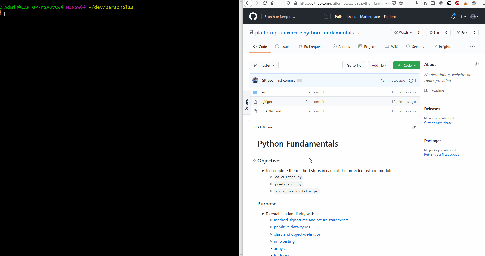
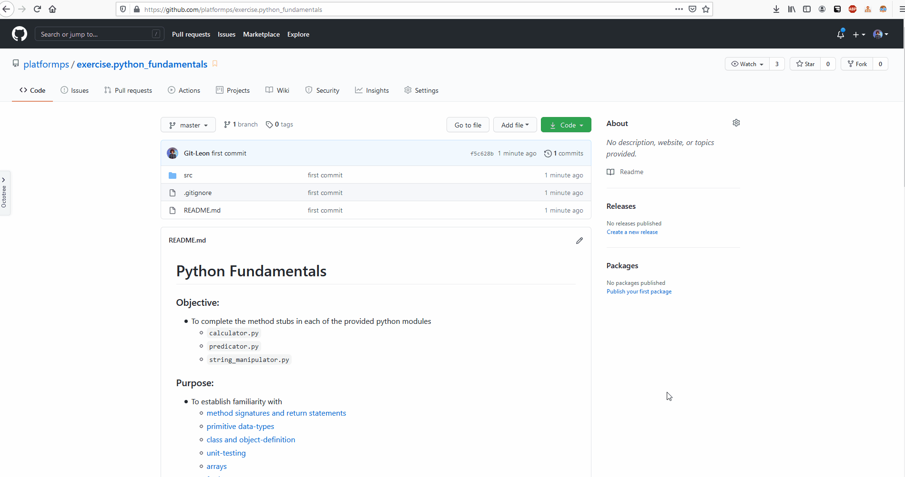

# Python Fundamentals

### **Objective:**
* To complete the method stubs in each of the provided python modules
	* `filterer.py`
	* `lister.py`

### **Purpose:**
* To establish familiarity with
    * [method signatures and return statements]()
    * [primitive data-types]()
    * [class and object-definition]()
    * [unit-testing]()
    * [arrays]()
    * [for loops]()
	
## Instructions

1. Fork this Repository
    * [fork](https://help.github.com/articles/fork-a-repo/) this repository to your personal github account 
    * [clone](https://help.github.com/articles/cloning-a-repository/) **your** `forked` repository to your local machine.
    * Complete steps 2, 3, and 4  
    * `git add` your changes to the list of your `commited` files.
    * `git commit` your added files to the list of your `staged` files.
    * `git push` your staged files to your remote repository.
    * submit a `pull request` which compares Perscholas `master` to your `master`.
2. Begin by first ensuring the `main` method in your `main_application.py` module prints `"Hello World!"` upon execution.
3. Create a continuous integration pipeline on [`TravisCI.com`](TravisCI.com)
    * Ensure that the pipeline is able to run each of the tests
    * Each test should fail before completing number 4
4. Complete each of the method stubs in each of the `main` classes provided.
    * There are comments above each method stub to describe the expected behavior.
5. Upon completion, open and run the all test-classes to ensure that all tests have 100% success.

## Demonstrations
### Opening in PyCharm
* The purpose of this animation is to demonstrate how to
    1. clone this project from the Github Web interface to your local machine
    2. navigate to the root directory of the project
    3. open the newly cloned project from your local machine in PyCharm
    4. open a module to be edited
    5. run corresponding tests for the module to be edited

    
    
### Running Tests From Command Line 
* The purpose of this animation is to demonstrate how to
    1. clone this project from the Github Web interface to your local machine
    2. navigate to the root directory of the project
    3. using `unittest`, run all python files with a prefix of `_test.py`
        * `python -m unittest discover -s ./src/test/ -p '*_test.py'`

